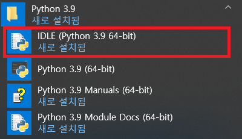

## 파이썬 설치

[https://www.python.org/downloads/](https://www.python.org/downloads/)

- Add Python 3.9 to PATH 체크(어느곳에서든지 파이썬 실행가능하게하는 옵션)

- 설치완료후 close 버튼눌러 종료한다.

## 파이썬 대화형 인터프리터


- "인터프리터" : 사용자가 입력한 소스 코드를 실행하는 환경을 뜻한다.
- "대화형": 입력에 따른 결괏값이 바로 출력되는것을 마치 대화하는것처럼 느껴지기 때문에, 대화형 인터프리터 라고 부른다
- 또는 간단히 파이썬 셸(Python shell) 이라고도 부른다
- 종료할때는 `[Ctrl+Z -> Enter]` 를 누른다

## IDLE로 파이썬 프로그램 작성하기

### 준비단계



- 에디터 창(Editor window): IDLE 이 실행되는 창이다
- 쉘 창(Shell window) : IDLE을 실행하면 가장먼저 나타나는 창. 에디터에서 실행한 결과가 표시되는 창.

### Hello world

1. IDLE 셸 창 메뉴에서 `[File -> New File]`을 선택한다.

   - 새로운 창이 나타난다. 이창이 IDLE 에디터이다.

2. 코드작성을 한다

```Python
# 이것은 주석입니다
print("Hello world")
```

3. 실행 해보자.

   - IDLE 에디터 창 메뉴에서 `[Run->Run Module]`을 선택한다
     (단축키:F5)
   - 경고창이 뜨는데, `hello.py`이름으로 저장한다
   - 확장자 이름은 항상 py로 해야한다.

4. 실행결과를 확인해보자.
   - IDLE 셸 창에 표시된다.

### 결론

- 간단한 예제는 셸에 입력해 결과를 바로 확인하고,
- 여러번 사용해야 하는 프로그램은 IDLE 에디터에서 작성하면 될것이다.

## cmd에서 실행하는 방법

```
C:\User\어디어디경로> python hello.py
Hello World

C:\User\어디어디경로>
```

## 추천 에디터

- 비주얼 스튜디오 코드(Visual Studio Code) - extension 설치후 사용.
- 파이참(Pycharm) - 30일 평가판.

## 본인 공부경로

- [https://wikidocs.net/](https://wikidocs.net/)
